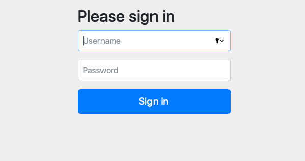

# CaWaStore

Esta aplicación consiste en una tienda de productos de calistenia (Crosfit).
Los usuarios adscritos a la página podrán comprar productos de toda clase relacionados con el deporte.

###### Función pública: 

- Se pueden visualizar todos los artículos de la tienda.

###### Funciones privadas:

- Se basan en las herramientas que tiene el vendedor para actualizar el catálogo y el administrador en caso de que una cuenta sea robada poder devolversela a su dueño.

###### Función de cada usuario:

- Los datos personales de cada uno, los productos adquiridos y el cesta de la compra.

## Las entidades de la aplicación son: 

- Usuario: debe contener su nombre, correo electrónico, identificador, avatar, método de pago y dirección de envío.
- Producto: debe contener identificador único, categoría de producto.
- Reseña: los clientes registrados pueden realizar una reseña de producto.
- Pedido: productos elegidos por el cliente, coste de la operación y disponibilidad.
- Promoción: descuentos aplicables a los productos.

## [Servicio interno](https://github.com/gonpg/CaWaStore-Rest)

- Envío de correo electrónico a los usuarios cuando se realiza una compra y se registra un nuevo usuario.

- Generación de pdf con la factura del pedido. 

## Modelo E/R:


## Diagrama de clases:


## Diagrama de clases y templates:


Rosa- Clases//
Morado- Repositorios//
Verde- Controladores//
Azul- Templates.

## Capturas de pantalla de la web

###Tienda


###Login



###Perfil del usuario


###Registro


###Crear producto


###Detalle de producto


###Producto eliminado


###Realizar pedido


###Reseña


## Diagrama de navegación:


## Despliegue de la máquina virtual:

1. Compilación

```
$ mvn package
```

Para omitir los tests:  
```
$ mvn clean package -DskipTests
```


2. Despliegue
```
$ sudo apt install openjdk-8-jdk-headless
$ sudo apt install mysql-server
$ sudo mysql_secure_installation (Configuración de mysql)
$ mysqld --initialize (En caso de que no cree el directorio)
$ sudo mysql
$ mysql> create database cawastore;
$ mysql> CREATE USER 'admin'@'localhost' IDENTIFIED BY 'administrador';
$ mysql> GRANT ALL ON cawastore.* to 'admin'@'localhost';
$ java -jar CaWaStore-0.0.1-SNAPSHOT.jar (Situar previamente el jar en el directorio HOME o hacer cd al directorio donde se encuentra)
$ java -jar CaWaStore-Rest-0.0.1-SNAPSHOT.jar (Situar previamente el jar en el directorio HOME o hacer cd al directorio donde se encuentra)
```

## Fase 4
componentes dockerizados en esta fase y definidos en el docker-compose:

- una instancia redis para la caché de datos
- dos instancias de balanceadores de carga haproxy, uno para la web y otro para el servicio interno
- dos instancias de la web
- dos instancias del servicio interno
- tres instancias de la base de datos con un master y dos exclavos (slaves)

------X------X-------

## Componentes del grupo: 

- Miguel Gonzalo Pérez González: mg.perez.2017@alumnos.urjc.es // https://github.com/gonpg

- José Ángel Sánchez Pérez: ja.sanchezp.2017@alumnos.urjc.es // https://github.com/joseangelsanchezperez


